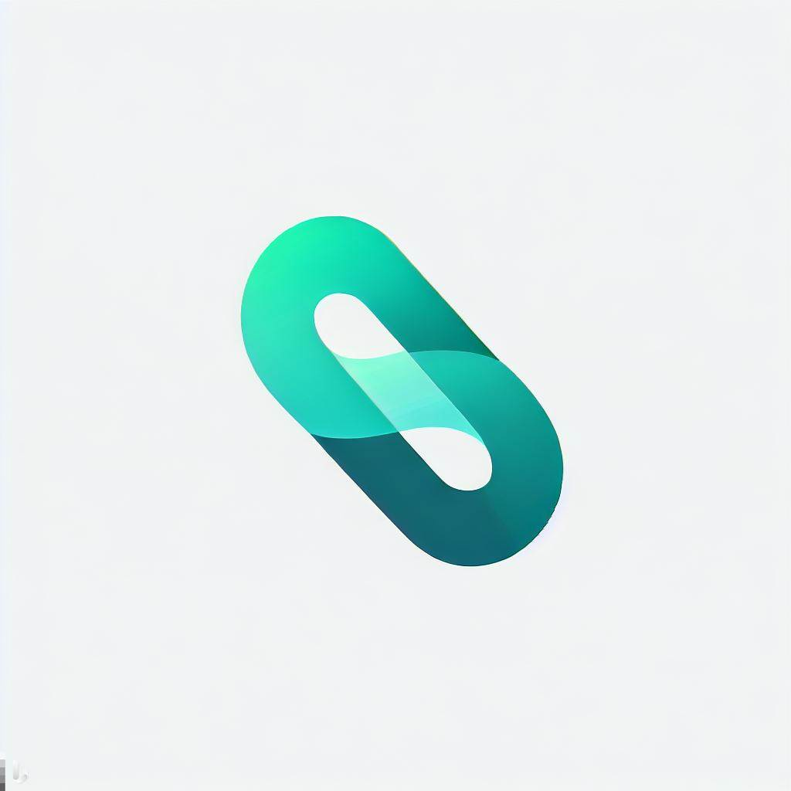

- [Project Description](#org7acddf8)
- [My Plan](#orgedb0028)
  - [Names](#orge5cc75f)
  - [Logo](#org9831b10)
    - [AI Generated Logo](#org3efc3a2)
    - [Final Logo (recreated in Inkscape)](#org64a48f0)
  - [Webpage Structure](#org7829bfb)
    - [Home](#orgac93895)
  - [Technologies to use](#orge94091a)
  - [UI/UX](#org53b179c)
    - [Colours](#orgd670f62)
    - [Fonts](#org220f45d)
    - [Design After choosing everything, I designed the prototype UI in Figma.](#orgcb3925f)


<a id="org7acddf8"></a>

# Project Description

Task: Task is to create a home page for a recruitment startup. This portal will be used by companies in India and worldwide for Hiring software engineers, Product Managers, Data Scientist etc. Please have a look at the 2-3 features from reference websites and develop it for the demo purpose. You have to make one page (home screen) for the frontend.


<a id="orgedb0028"></a>

# My Plan


<a id="orge5cc75f"></a>

## Names

I generated a few names for the website using ChatGPT and decided to choose &ldquo;HireWise&rdquo;.

1.  HireWise (Final)
2.  HireGuru
3.  SkillGenie
4.  TalentMagnet


<a id="org9831b10"></a>

## Logo

I used Bing AI to generate a simple logo for the website and later recreated it in Inkscape.


<a id="org3efc3a2"></a>

### AI Generated Logo




<a id="org64a48f0"></a>

### Final Logo (recreated in Inkscape)


<a id="org7829bfb"></a>

## Webpage Structure

I then used ChatGPT to provide me sample data to put on the homepage-


<a id="orgac93895"></a>

### Home

1.  Header

    -   Logo
    -   Navbar

2.  Hero section

    -   Heading: &ldquo;Discover Your Path to Success&rdquo;
    -   Subheading: &ldquo;Unlock Your Potential With Our Premiere Recruitment Solutions&rdquo;
    -   Button: &ldquo;Explore Opportunities&rdquo;
    -   Illustration I used [undraw.co](https://undraw.co) to get an open source illustration for the website which has matching colours from the logo.
        
        

3.  About Us

    At HireWise, we are passionate about connecting exceptional talent with innovative companies across the globe. Our mission is to revolutionize the recruitment process and bridge the gap between top-tier candidates and leading organizations. With our cutting-edge technology and dedicated team, we make hiring and job seeking seamless, efficient, and rewarding.

4.  How It Works

    -   For Companies
        1.  Post a Job Opening
        2.  Get Intelligent Recommendations
        3.  Connect and Hire
    -   For Job Seekers
        1.  Create a Profile
        2.  Explore and Apply
        3.  Get Hired

5.  Featured Job Categories

    -   Software Engineer
    -   Product Manager
    -   Data Scientist
    -   And More!

6.  Testimonials

    -   &ldquo;HireWise has been a game-changer for our hiring process. We found the perfect candidate within days!&rdquo; - XYZ Tech Solutions
    -   &ldquo;Thanks to HireWise, I landed my dream job at an amazing company. Highly recommended!&rdquo; - John Doe, Software Engineer

7.  A &ldquo;These companies trust us&rdquo; section

    -   Logos of a few 10-20 companies sliding around or animated in some way.

8.  Footer

    -   Copyright Info
    -   Quick links to social media profiles
    -   Links to privacy policy and terms of service


<a id="orge94091a"></a>

## Technologies to use

1.  ReactJS
2.  CSS (or TailwindCSS)
3.  Javascript


<a id="org53b179c"></a>

## UI/UX

I created several wireframes on my notepad for all the sections of the page.


<a id="orgd670f62"></a>

### Colours

Then, I selected colours matching the logo from [Realtime Colors](https://realtimecolors.com). These are the CSS variables that I will use-

```css
--text: #050505;
--background: #fafafa;
--background-alt: #EDEDED;
--primary: #1CCFBC;
--primary-alt: #CDF2EE;
--accent: #5860a7;
--accent-alt: #dedfed;
```


<a id="org220f45d"></a>

### Fonts

I will use &ldquo;DM Sans&rdquo; for the headings and &ldquo;Inter&rdquo; for other text from Google Fonts.


<a id="orgcb3925f"></a>

### Design After choosing everything, I designed the prototype UI in Figma.

Here&rsquo;s the link- [Figma File](https://www.figma.com/file/iTdLFPCDx1DGmjCpH3BTWu/Untitled?type=design&node-id=1%3A2&mode=design&t=AiSPUZsFcdoPqOzs-1)